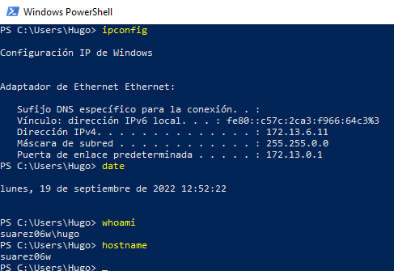
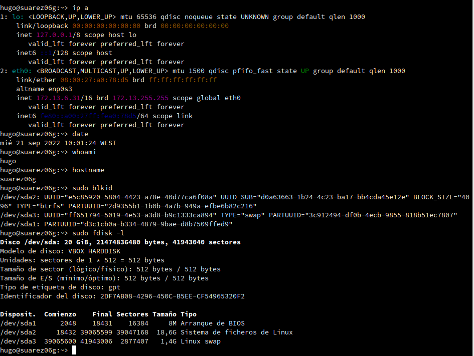
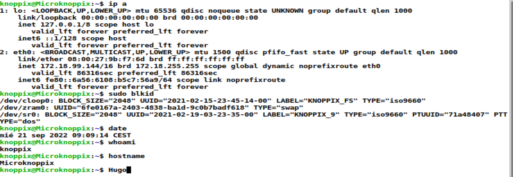

Hugo Suárez Pérez
ASIR

# CD-Live vs Instalación
En la practica de hoy hemos tenido que instalar 3 máquinas virtuales con distintas ISO, la primera Windows, la segunda OpenSUSE, la tercera Knoppix. Una vez instaladas las MV probamos los siguientes comandos en los terminales.

##Windows

##OpenSUSE

##Knoppix

