Hugo Suárez Pérez
ASIR

# Juego Comandos Linux GameShell

## Misión 1
Objetivo:

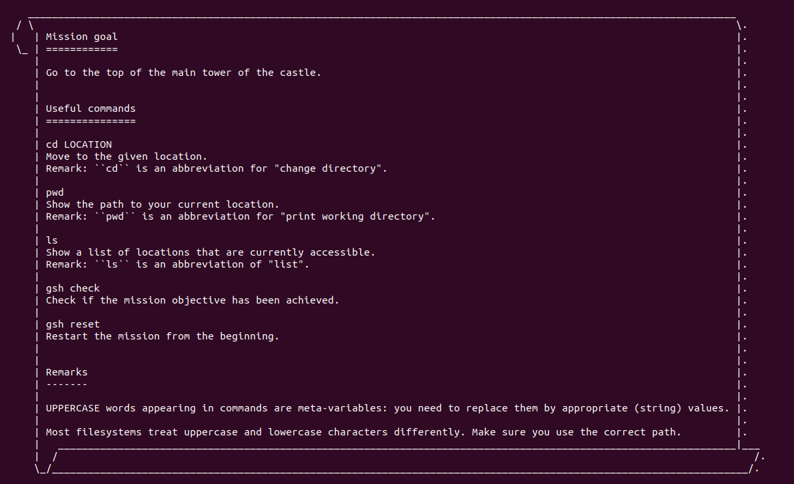

Resultado:

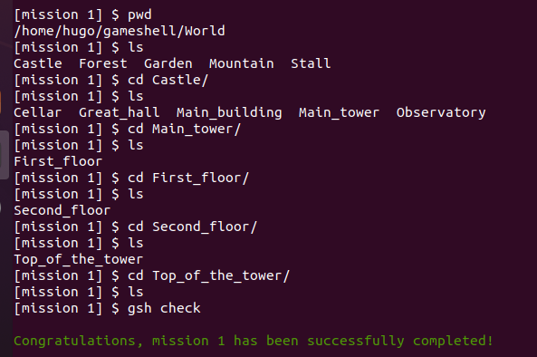

## Misión 2
Objetivo:

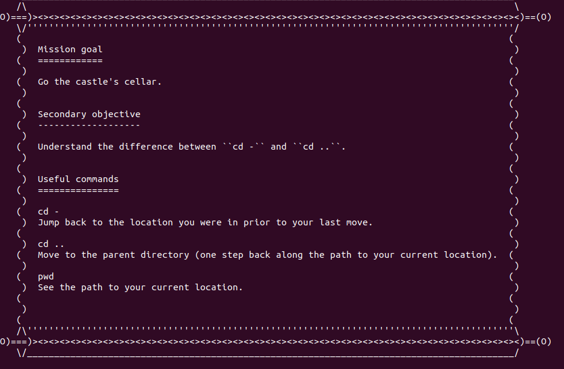

Resultado:

## Misión 3
Objetivo:

Resultado:

## Misión 4
Objetivo:

Resultado:

## Misión 5
Objetivo:

Resultado:

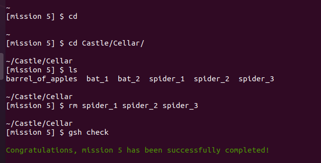

## Misión 6
Objetivo:

Resultado:

## Misión 7
Objetivo:

Resultado:

## Misión 8
Objetivo:

Resultado:

## Misión 9
Objetivo:

Resultado:

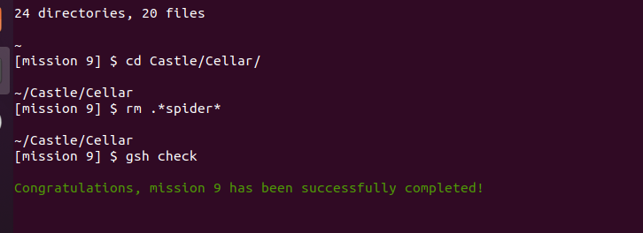

## Misión 10
Objetivo:

Resultado:

## Misión 11
Objetivo:

Resultado:

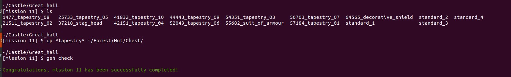

## Misión 12
Objetivo:

Resultado:

## Misión 13
Objetivo:

Resultado:

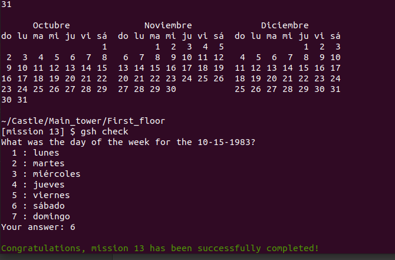

## Misión 14
Objetivo:

Resultado:

## Misión 15
Objetivo:

Resultado:

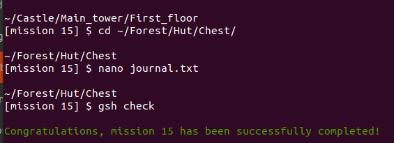

## Misión 16
Objetivo:

Resultado:

## Misión 17
Objetivo:

Resultado:

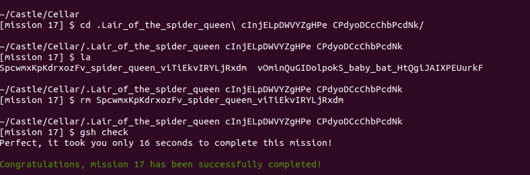

## Misión 18
Objetivo:

Resultado:

## Misión 19
Objetivo:

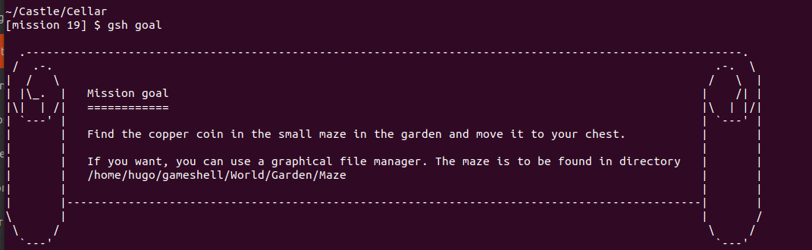

Resultado:

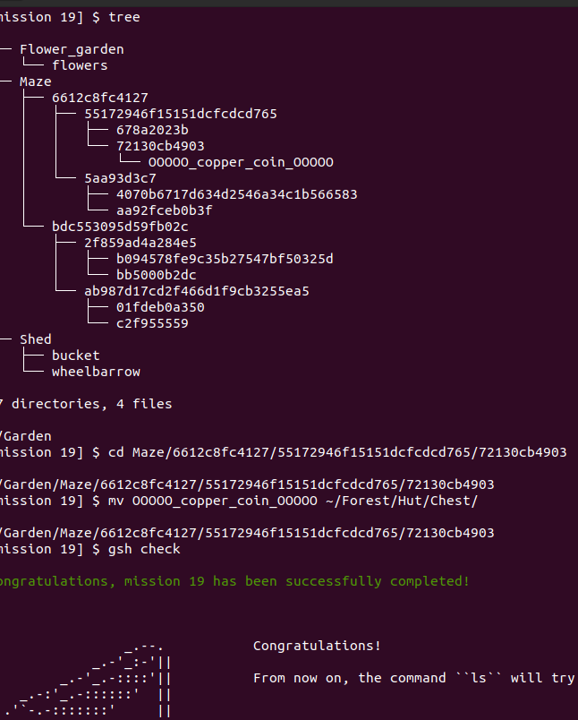

## Misión 20
Objetivo:

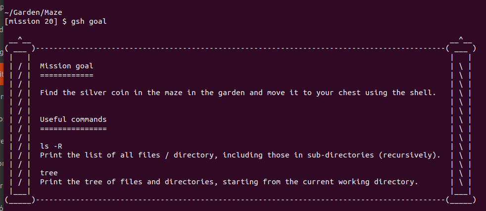

Resultado:

## Misión 21
Objetivo:

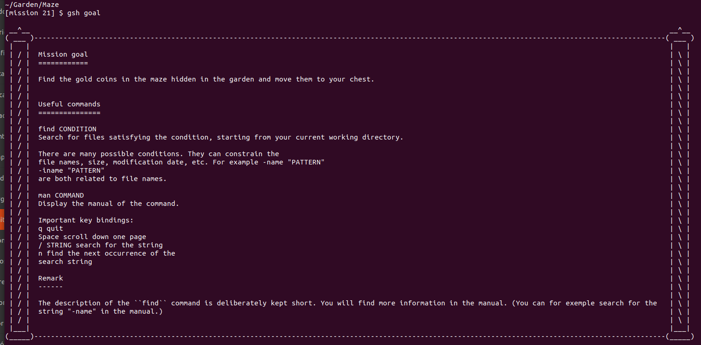

Resultado:

## Misión 22
Objetivo:

Resultado:

## Misión 23
Objetivo:

Resultado:

## Misión 24
Objetivo:

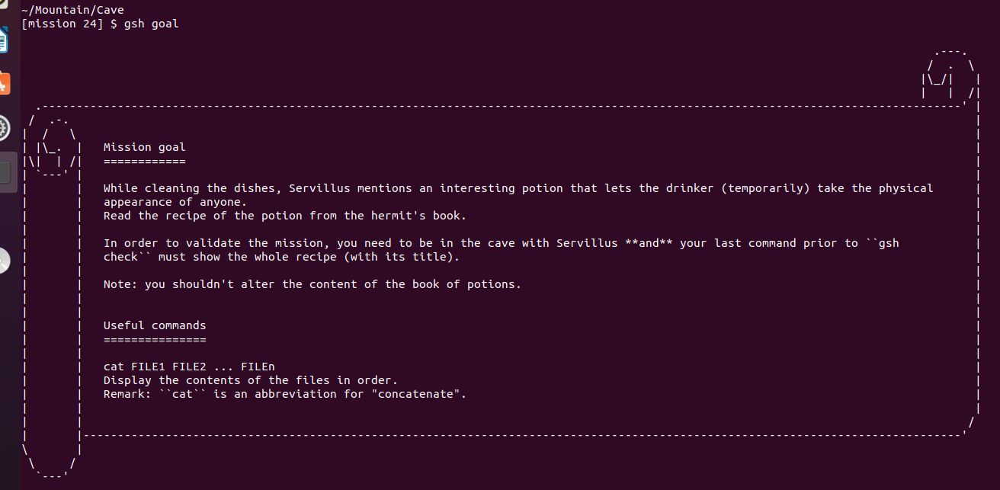

Resultado:

## Misión 2
Objetivo:

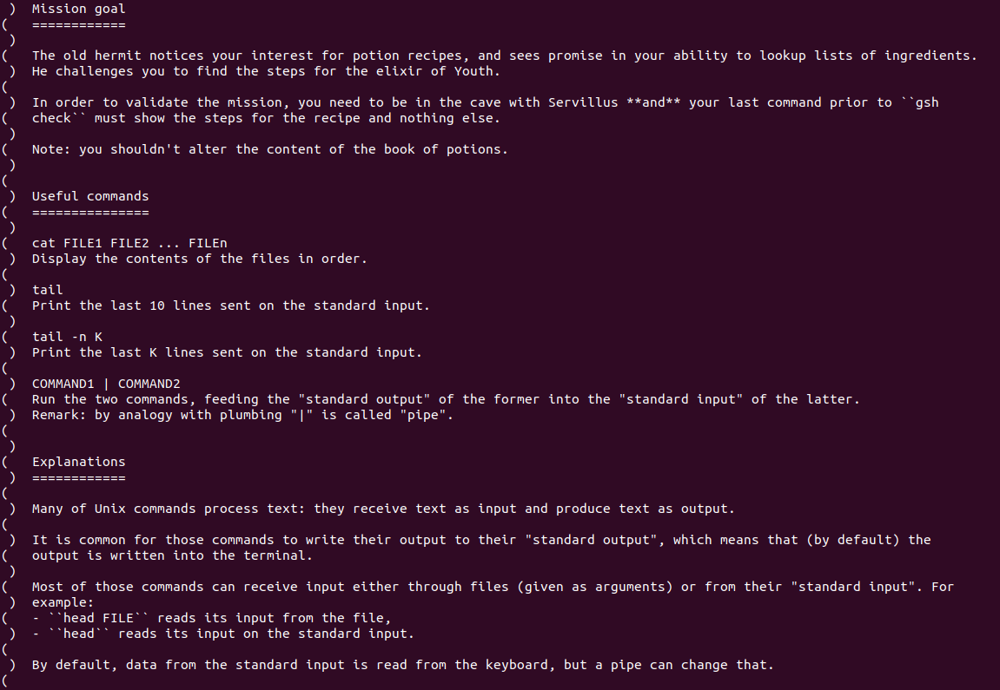

Resultado:

## Misión 26
Objetivo:

Resultado:

## Misión 27
Objetivo:

Resultado:

## Misión 28
Objetivo:

Resultado:

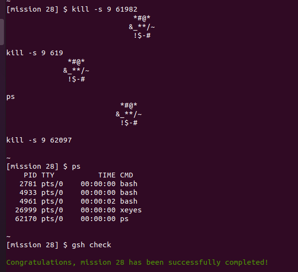

## Misión 29
Objetivo:

Resultado:

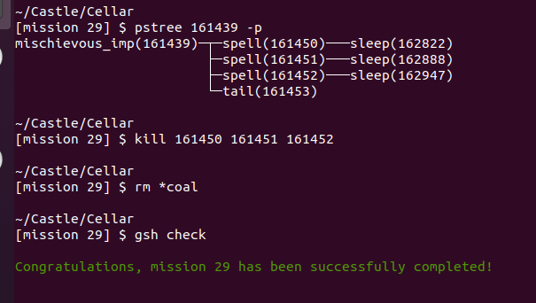

## Misión 30
Objetivo:

Resultado:

