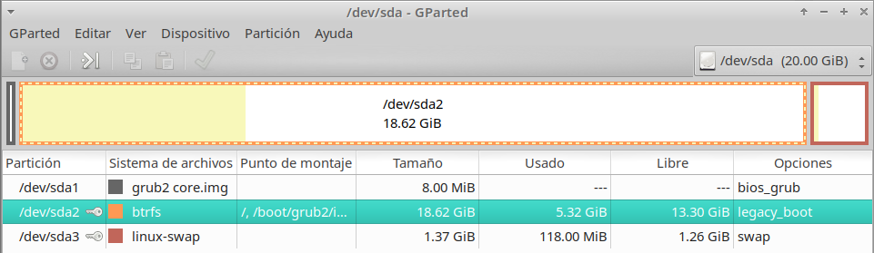
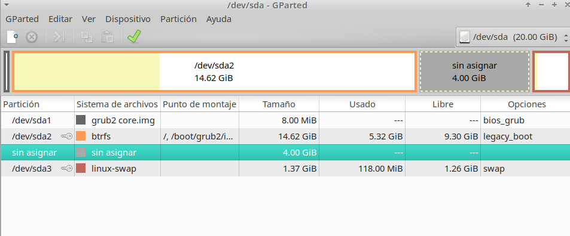
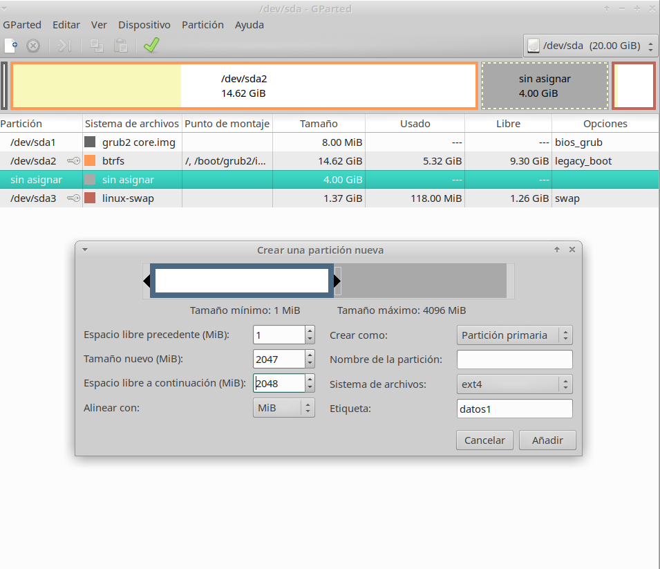
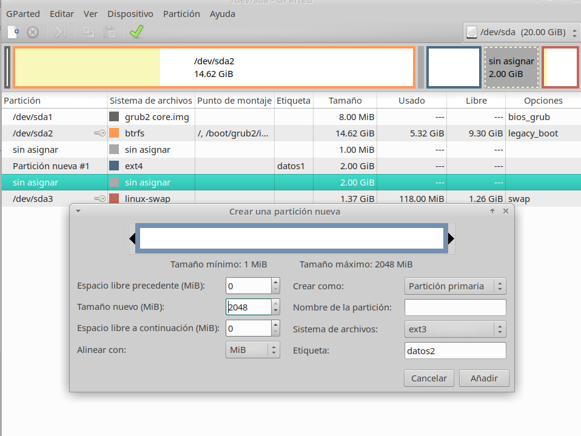
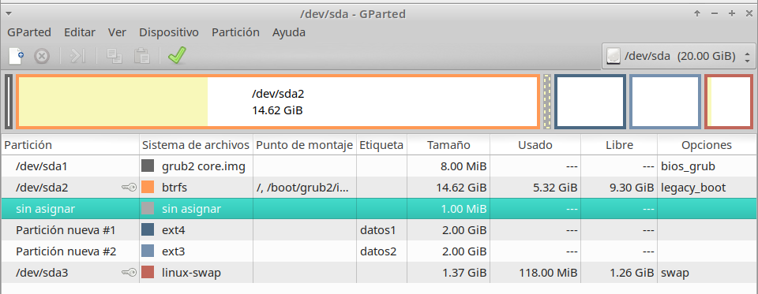

Hugo Suárez Pérez
ASIR

# Particiones en Linux con Gparted

Vamos a realizar una partición del disco duro en OpenSUSE, para eso necesitamos primero instalar el Gparted desde la terminal con "zypper install gparted", y abrimos el Gparted.

Redimencionamos el disco principal quitandole 4GB.

Realizamos una partición de 2GB con formado ext4 y etiqueta datos1.

Realizamos una partición de 2GB con formado ext3 y etiqueta datos2.

Y mostramos como quedaría.

