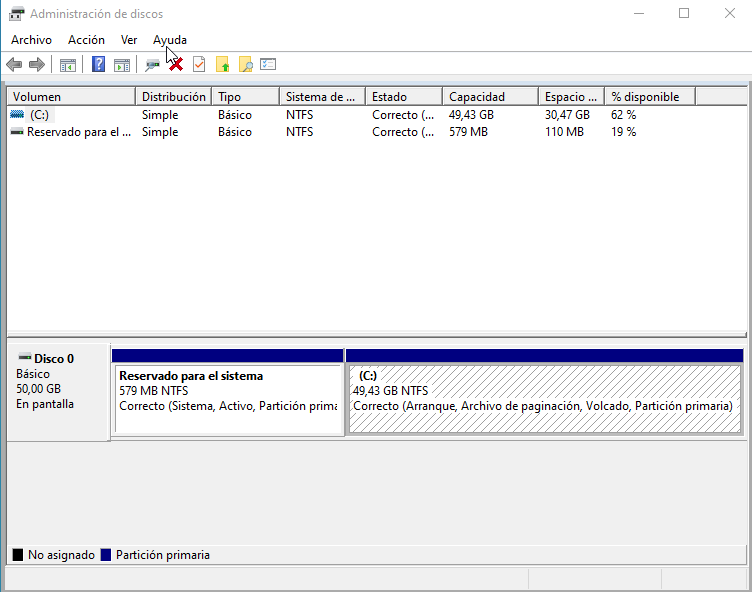
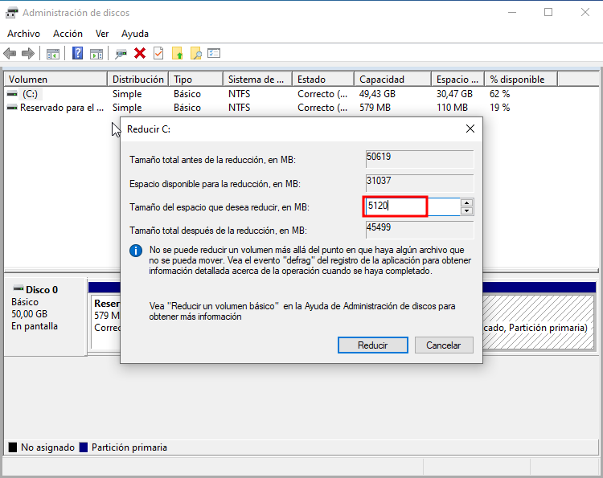
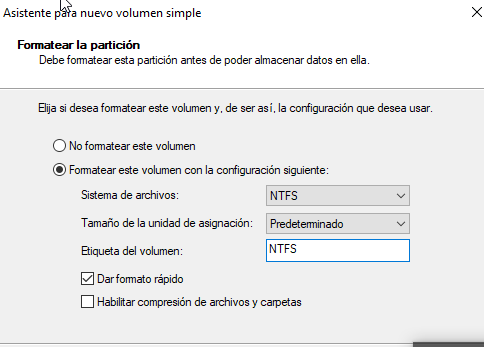
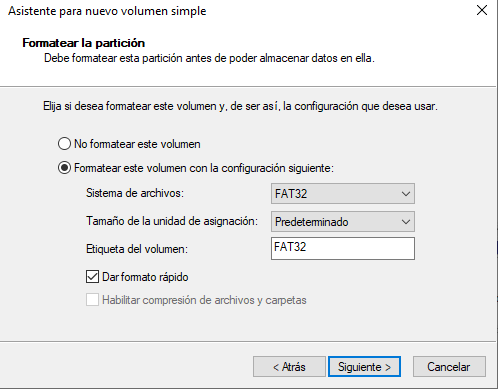
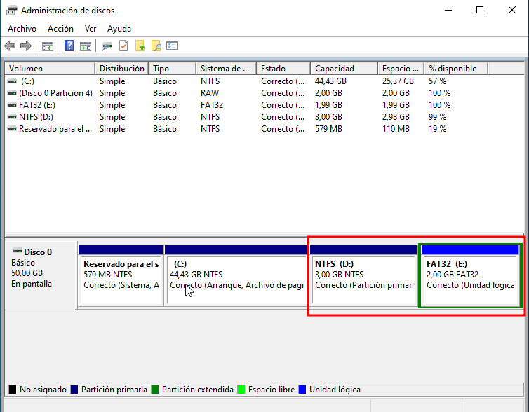

Hugo Suárez Pérea
ASIR

# Partición de Disco en Windows
Para realizar una particiñon de disco duro en Windows lo primero que tenemos que hacer es ir a "Crear y formatear particiones del disco duro"

Hacemos click derecho en el disco que queremos hacer la partición y selecionamos reducir volumen.

Nos sale una pestaña y ponemos el tamaño que queremos la partición. Ya tendremos hecha la particion de 5 GB, ahora tenemos dividir en dos la particiñon de 5GB para que una parte sea de 3 GB en formato NTFS.

Y lo otro va a ser de 2 GB, es decir el resto, en formato FAT32.

Y mostramos como quedaría.

