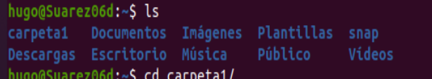
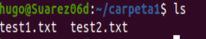
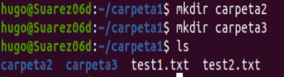
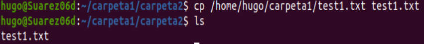
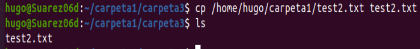
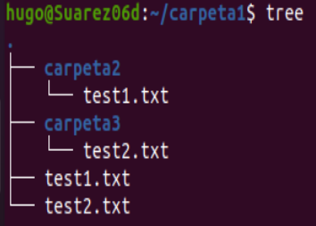
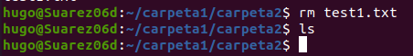
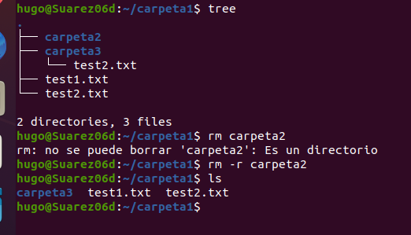
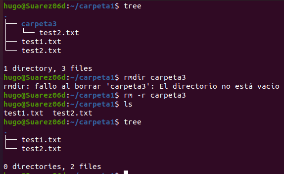
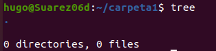

Hugo Suárez Pérez
ASIR

# Comandos Básicos Linux 1
Primero abrimos el terminal y creamos “carpeta1”en nuestra carpeta personal “home/hugo”.

Nos movemos a carpeta1 y creamos “test1” y “test2”.

Creamos también dentro de carpeta1 “carpeta2” y ”carpeta3”.

Nos movemos a carpeta2 y copiamos test1 dentro.

Nos movemos a carpeta3 y copiamos test2 dentro.

Mostramos como va quedando.

Borramos test1 de carptea2.

Borramos carpeta2.

Borramos carpeta3.

Y después de borrar los dos txt que habían en carpeta1 debería quedar vacío y lo mostramos.

