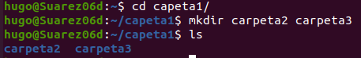
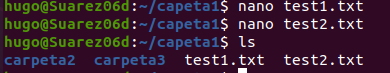
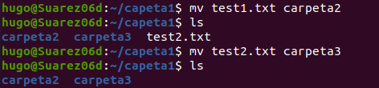
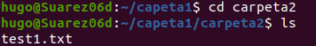
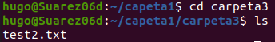
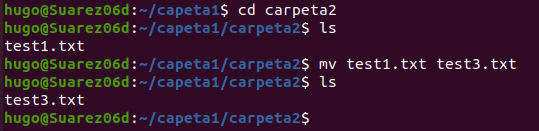
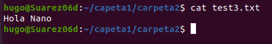
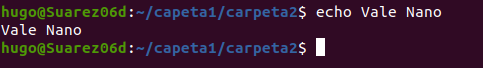
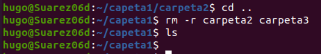

Hugo Suárez Pérez

ASIR

# Comandos Básicos Linux 2

Abrimos el terminal y creamos la carpeta1 y mostramos.

Nos movemos dentro de la carpeta1 y creamos carpeta2 y carpeta3 con un solo comando.

Con nano creamos test1 y test2, que en test 1 ponga “Hola Nano” y en test 2 “Adios Nano”.

Movemos con mv test1 a carpeta 2 y test2 a carpeta3.

Nos movemos a carpeta2 y mostramos.

Nos movemos a carpeta3 y mostramos.

Nos movemos otra vez a carpeta2 y cambiamos el nombre de test1 a test3 con mv.

Con cat mostramos el contenido de test3.

Hacemos un “echo Vale Nano”.

Borramos carpeta2 y 3 con un solo comando.

Nos movemos con “cd” o “cd~” a home/hugo, mostramos con pwd que estamos, hacemos whoami y enseñamos el hostname.

